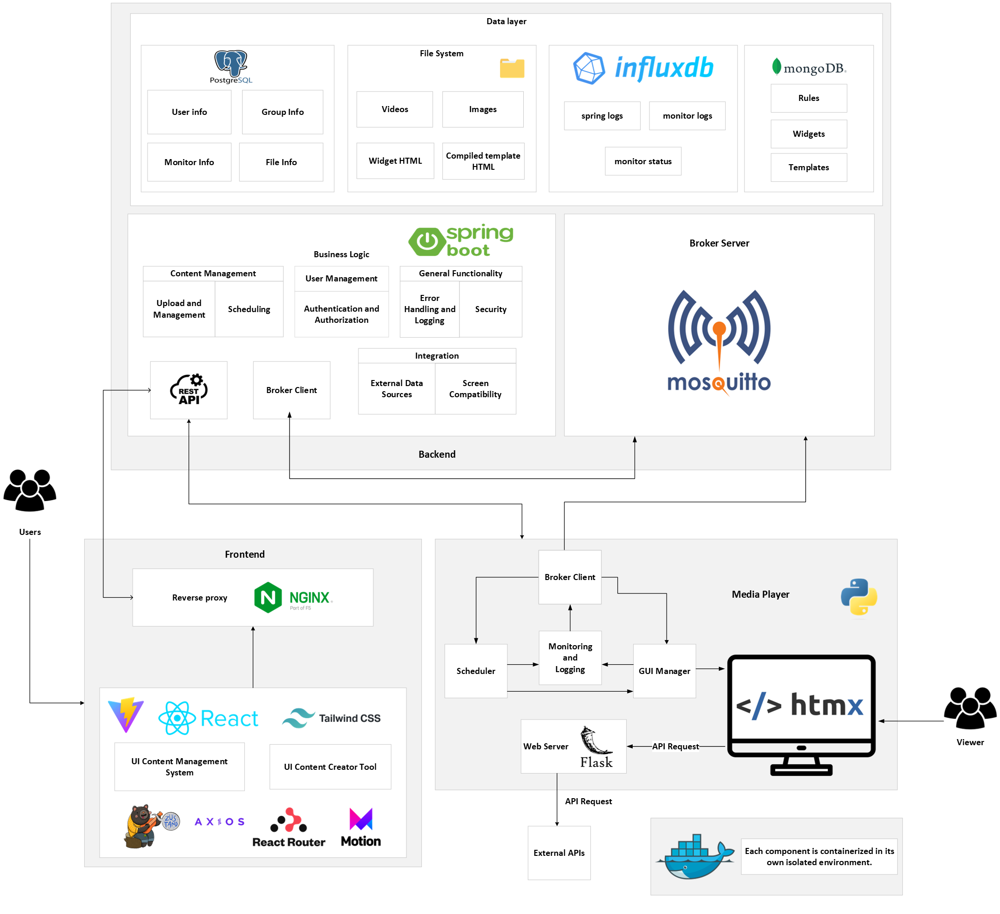

## About the project
UA Smart Signage, an open source digital signage display software, offers **customizable** templates, advanced content **scheduling** and an array of incremental features. 
Its **user-friendly** interfaces ensure a seamless experience for both tech-savvy individuals and those with limited technical knowledge, delivering a robust **UX** for all users.

### Architecture

### Tech Stack
#### Frontend
Designed for two users - the manager (admin) and the designer (template creator).
The frontend will be developed using React and will be served via an Nginx server, which will also serve as a reverse proxy for the Spring Boot backend. For styling, Tailwind CSS will be utilized in React, alongside libraries such as Zustand, Framer Motion, Axios, and React Router.
##### React
We opted for React due to its widespread usage and backing by a major company, Meta. This framework facilitates the creation and reuse of components across multiple pages within the application.  Additionally, React provides a plethora of libraries that we can leverage if needed.
##### Tailwind
We've opted for the Tailwind CSS framework because, unlike other CSS frameworks such as Bootstrap, it provides enhanced control over HTML components without requiring direct manipulation of vanilla CSS. This streamlines the development process and offers better maintainability compared to traditional CSS approaches.
##### React Icons
React Icons is a React library that offers a diverse range of icons that we can utilize within our HTML content.
##### Axios
Axios is a straightforward, promise-based HTTP client that ensures enhanced consistency across various browsers. It operates at a higher abstraction level compared to fetch, resulting in more readable code. Axios also allows the creation of Request and Response Interceptors, which will be useful for adding authentication headers.
##### Zustand
Zustand is a state manager with a hook-based API that allows for the management of local states within the application. Additionally, these states can be stored in the local storage.
##### React Router
React Router enables client-side routing, providing a more responsive and speedy experience for users.

#### Backend
- mongo (...)
- 
#### Media Player
- mosquitto (...)

#### Deployment
To provide an easy-to-start implementation, we are using docker to facilitate initialization and development.

## Getting started
### Requirements
- Computer to host the server
- Computer to receieve information and host software (Media Player)
- Internet connection
- Computer to host the user interface for the users
- Monitor to display information
### Setup
#### Setting up the hosting server
(...)
#### Setting up the user interface
(...)
#### Setting up the monitor for display 
Make sure that you have connected your monitor to a (mini) computer and install the following OS image on it.
[OS image link]
To install the OS image (...)
To address some internal problems with UA you should connect to (...)

## Included material

- "Free animated SVG weather icons" by "amCharts". Licensed under the Creative Commons Attribution 4.0 International License (CC BY 4.0). To view the original work go [here](https://www.amcharts.com/free-animated-svg-weather-icons/ "free-animated-svg-weather-icons").
