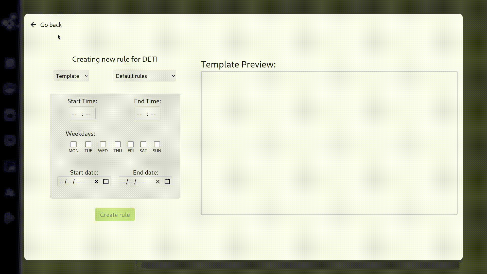

To understand the different parts of our system, we first need to understand what goes on behind the curtains. In summary, when a user chooses what he wants to be displayed on the screen he chooses one of the `Templates` and selects what the `Contents` of some of the `Widgets` are. Behind the scenes this is all put together and creates an `HTML file` that the `Media Player` will display.

## Group

Each Screen/Monitor must be inside a group. These groups allow the user to `group` different screens and choose what is being displayed in them at the same time.

## Widget

To make our system customizable what is displayed on the screen is divided into `Widgets`. They are html snippets that are able to receive variables to customize how we want them to look. When a widget is placed in a template, positional variables are added to it, in this case the `Top`, `Left`, `Width` and `Height`. These variables allow us to choose the exact size and position of the widget inside the template but extra variables can be added through the use of [contents](#content). To learn more about widgets visit [the widgets section]().

## Template

A template is simply a collection of widgets. The HTML of a template is created by adding up the HTML of all it's widgets.

## Content

The widgets have some variables inside them by default like `Width` and `Height` but some of them have some extra `contents`. For example, the `Media` and `Temperature` widgets shown in the gif above allow the user to choose some extra information. These contents have a `Type`, like `Media` and `Options`, that are used decide what the user can choose for a certain widget.

## Schedule

The system allows the user to choose when a certain template is going to be displayed. A `Schedule` stores this information.

## Rule

A Rule is a combination of multiple parts. It says `what group` displays `what template` at `what schedule` with `what content`. (called TemplateGroup in the Backend)