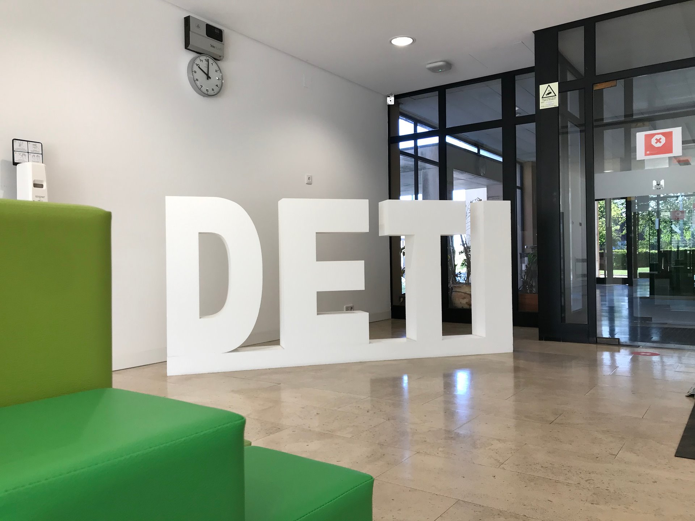

# UASmart Signage Platform

Welcome to the UASmart Signage Platform! This platform provides a comprehensive solution for managing and displaying digital signage content.

## Overview

The UASmart Signage Platform offers the following features:

- **Easy content management:** Upload and organize your digital signage content with a user-friendly interface.
- **Flexible scheduling:** Schedule your content to be displayed at specific times and dates.
- **Real-time monitoring:** Monitor the status and performance of your digital signage displays in real-time.
- **Customizable templates:** Choose from a variety of templates to create visually appealing signage.

## Documentation

For detailed information on using the UASmart Signage Platform, refer to the [full documentation](index.md).

