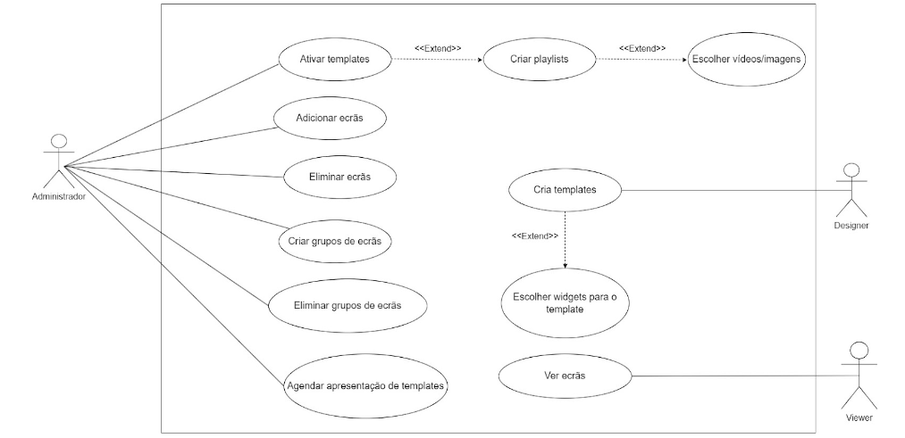

# Informatics Project

## Project Proposal
[A Digital Signage System for DETI](/docs/files/Project_Proposal.pdf)

## Inception Phase
[M1: Inception Phase Presentation](/docs/files/M1_Presentation.pdf)

### Context
(...)

### Problem
#### Integration with the university’s IDP
(...)
#### Test driven development implementation
(...)
#### User friendly Content Creation Tool (CCT)
(...)
#### Good documentation and installation guides
(...)
#### Scalability and Performance
(...)

### Goals
#### Manage electronic displays remotely.
(...)
#### Have a Media Player that allows for displaying content and receive real time updates from different sources.
(...)
#### Have a Content Management System to manage all the screens and allow scheduling and timing of content playback.
(...)
#### Create a Content Creation Tool that assists the users designing the templates.
(...)

### Expected Results
#### Minimal Viable Product (MVP) of a Digital Signage System
(...)
#### User-friendly Content Management System (CMS) and Content Creation Tool (CCT)
(...)
#### Integration with the university’s IDP
(...)
#### OS image that auto-boots into the Media Player upon startup
(...)
#### All the code should include tests and comments
(...)
#### Clear documentation and contribution guidelines
(...)

### Task list
#### Raspberry pi configuration
(...)
#### Template design/requirements
(...)
#### Architecture development / System design and planning
(...)
#### Content Distribution Strategy
(...)
#### Communication plan (documentation)
(...)
#### Tests (User acceptance and System)
(...)
#### User friendly CCT
(...)

### Calendar
[link to presentation calendar]
[link to new calendar]

### Inner Sprint (01/03/2024 - 08/03/2024)
- Create github organization (and add tutors to it)
- Add tutors to discord and create respective channels
- Start working on documentation
- Research about different real life examples (in practice)
- Organize group into sub-groups
- Document with link to the website
- Create and propose architecture  **(Everyone)**
- Requirements gathering, both functional and non-functional and personas with scenarios. **(Rafael, Miguel, Diogo)**
- Create calendar **(Rafael, Miguel, Diogo)**
- Figma **(Tomas, Pedro)**
- MP mockup **(Joao, Tomas)**

#### Sprint results
All items were completed within time. 

## Elaboration Phase
[M2: Elaboration Phase Presentation](/docs/files/M2_Presentation.pdf)

### Comunication Plan

The following table summarizes the recommended communication channel based on the purpose of communication:

| Purpose | Channel |
|---|---------|
| Real-time discussions, quick updates, task delegation and informal communication. | Discord |
| Formal communication, and information sharing. | Outlook |
| Code collaboration, version control, and issue tracking. | Github  |

**Detailed Use Cases**

* **Discord** 
	* **Use Cases:**
		* Team discussions for brainstorming, project updates, and ad-hoc questions.
      	* Assigning tasks and tracking progress.
		* Sharing quick wins, announcements, and real-time project status updates.
* **Outlook** 
	* **Use Cases:**
		* Sending official emails, meeting information, and project reports.
* **Github** 
	* **Use Cases:**
		* Hosting code repositories, managing changes, and tracking development progress.
		* Reporting bugs, requesting features, and collaborating on code solutions.
		* Maintaining a central location for project files and documentation.

### Roles
(...)

### Organization
[UA Smart Signage](https://github.com/UA-Smart-Signage-Platform)
#### Repositories
- [Documentation Website](https://github.com/UA-Smart-Signage-Platform/Documentation-Website)
- [Content Manager System and Content Creator Tool](https://github.com/UA-Smart-Signage-Platform/Content-Manager-System-and-Content-Creator-Tool)
- [Media Player](https://github.com/UA-Smart-Signage-Platform/Media-Player)
### Context and State of The Art (SOA)
(...)
In the context of digital signage Aveiro University (UA) has been using static display for videos and information in televisions across all monitors within the Department of Eletronics, Telecommunications and Informatics (DETI). No prior software has been developed in this regard within UA.

The objective of this project is to build a system that will be used over the years and done in a way that can be improved and built on easily.

### Functional Requirements
**Content Management**:
	Ability to upload, manage and organize content.
	Support for various media formats (images, videos, audio, text).
	Content scheduling for specific times or events.

**Display Management**:
	Control over which screens display specific content.
	Grouping of screens.
	Support for remote display management and configuration.

**Integration**:
	Integration with external data sources (RSS feeds, social media, APIs) for dynamic content.
	Compatibility with various screen types.

**User Interface**:
	Intuitive user interface for content management.
	Role-based access control for different users (administrators, content managers, etc.).
	Reporting and analytics features to track content performance and screen status. (idk about this one).

### Non-Functional Requirements
**Performance**:
	Fast response times for content uploads and updates.
	Smooth playback without buffering or lag.
	Scalability to support a growing number of screens and users.

**Reliability**:
	High availability to ensure screens are always operational.
	Fault tolerance to handle hardware failures or network issues.
	Disaster recovery capabilities to recover from system failures (backups).

**Security**:
	User authentication and authorization mechanisms.
	Encryption of data during transmission and storage.
	Protection against unauthorized access and tampering of content (jwt + smth).

**Scalability**:
		Ability to scale the system as the number of screens or content volume increases.

**Usability**:
	Support for multiple languages (pt/en etc.).
	Responsive design for user interfaces across different devices (maybe).

**Compatibility**:
	Compatibility with various operating systems and web browsers (raspi by construction should be always the same, react should be universal).
	Compliance with industry standards and protocols (HTML5 + RESTful APIs).

### Personas

#### Nuno - DETI Director

**Name:** Nuno

**Age:** 37

**Occupation:** Technician

**Background:**

* Seasoned university employee with over 15 years of experience.
* Recognized for administrative excellence and valued by colleagues.
* Limited experience with design aspects.
* Prefers user-friendly and straightforward technological platforms.

**Goals:**

* Effortlessly share pre-made content, including:
	* News announcements
	* Promotional videos
	* Other relevant resources
* Manage the displayed information through a simple and intuitive interface (add/remove screens).

**Note:** Nuno's technical expertise lies primarily in administrative tasks. Aim to provide clear and concise instructions for content management.
(maybe remove)

#### Sara - UI/UX Designer

**Name:** Sara

**Occupation:** Designer

**Age:** 30

**Profile:**

* **Software:** Prefers feature-rich and customizable tools to unleash her creative potential.
* **Workflow:** Values efficient tools that streamline design processes and enable quick production of high-quality content.
* **Design Approach:** Enjoys experimentation with various design elements and actively seeks new features and functionalities.

**Goals:**

* Create engaging content specifically designed for display on DETI screens.
* Utilize her creativity to design unique templates for showcasing on designated displays.

#### Rodrigo - DETI Student

**Name:** Rodrigo

**Age:** 19

**Background:**

* Enthusiastic and curious student with a thirst for new knowledge and experiences.
* Actively seeks out relevant information related to academics, cultural events, and networking opportunities.

**Goals:**

* Easy and swift access to crucial information concerning:
	* Coursework
	* Academic events
	* Extracurricular activities
* Clear and organized presentation of information for staying updated on the go.

### Use Cases

### User Stories

#### As an administrator:
- **Edit Template Content:** I want to edit template content so that I can keep it up-to-date.
- **Schedule Content:** I want to schedule specific content on digital screens at designated times and dates so that I can effectively manage content dissemination.
- **Delete Templates:** I want to delete templates so that I can remove outdated or unused content.
- **Edit Groups of Screens:** I want to edit groups of screens so that I can update the organization of presentations.

#### As a designer:
- **Create Templates:** I want to create templates so that I can define the structure and content of presentations.
- **Choose Widgets:** I want to choose widgets for the template so that I can add interactive elements to presentations.

#### As a viewer:
- **View Screens:** I want to see screens so that I can stay updated with the latest content.
- **View Scheduled Content:** I want to view content scheduled for specific times or dates so that I know what information is available when.

